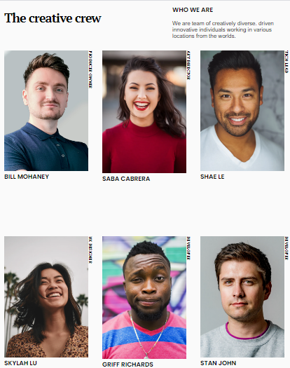

<!-- Please update value in the {}  -->

<h1 align="center">My team page</h1>

   Solution for a challenge "My team page".

  <h3>
    <a href="https://github.com/ravinalamada/my-team-page">
      Demo
    </a>
     | 
    <a href="https://wizardly-beaver-3a02b2.netlify.app/">
      Solution
    </a>
  </h3>

<!-- TABLE OF CONTENTS -->

## Table of Contents

-   [Overview](#overview)
    -   [Built With](#built-with)
-   [Features](#features)
-   [Contact](#contact)
-   [Acknowledgements](#acknowledgements)

<!-- OVERVIEW -->

## Overview

;

Introduce your projects by taking a screenshot or a gif. Try to tell visitors a story about your project by answering:

-   Where can I see your demo?
You can see my demo in Github by following the demo link which gave above.

-   What was your experience?
My experience is that I could layed the figcapition text contents easily by setting these properties value (writing-mode: vertical-rl;
text-orientation: mixed;) which I had never known before.

-   What have you learned/improved?
What I have learned is that the writing-mode property works as a tranform property works.

### Built With
-   [Tailwind](https://tailwindcss.com/)

## Features

<!-- List the features of your application or follow the template. Don't share the figma file here :) -->

## Acknowledgements

<!-- This section should list any articles or add-ons/plugins that helps you to complete the project. This is optional but it will help you in the future. For exmpale -->

## Contact

-   Website [your-website.com](https://wizardly-beaver-3a02b2.netlify.app/)
-   GitHub [@your-username](https://github.com/ravinalamada)

